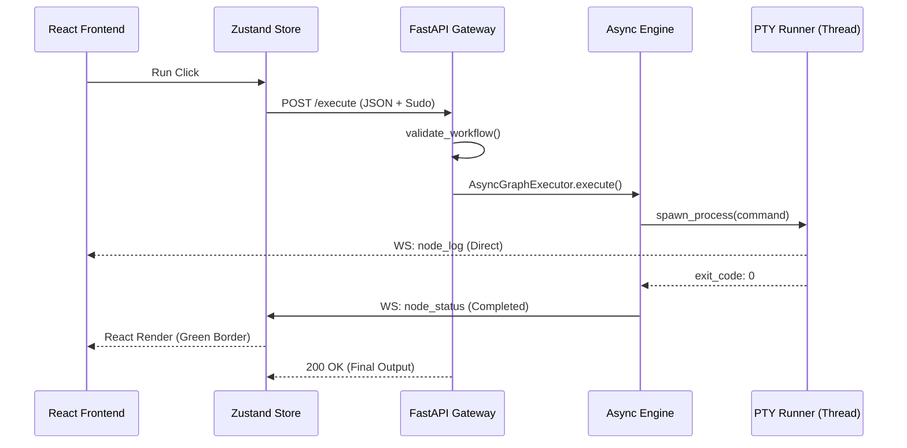

# Workflow Execution Lifecycle

This document outlines the end-to-end flow of a FlowX2 workflow, tracing the path from a user's click in the frontend to the final execution on the host machine.

## 🔄 High-Level Orchestration

The execution lifecycle is a synchronized dance between three main layers:
1.  **Frontend (Zustand Store)**: The UI state manager and event listener.
2.  **API Gateway (FastAPI)**: The request validator and task orchestrator.
3.  **Engine (AsyncGraphExecutor)**: The graph-traversal logic and sandboxed runtime.

---

## 🛰 The 8-Step Lifecycle

### 1. Trigger Phase (Frontend)
When the user clicks the "Run" button:
-   **`useWorkflowStore.executeGraph()`** is invoked.
-   **Sudo Validation**: The store checks for `sudoLock` nodes. If needed, it retrieves credentials from the `VaultNode` or prompts the user.
-   **State Reset**: All nodes are reset to `idle`, and internal logs are cleared to ensure a fresh UI state.

### 2. Handshake Phase (API)
-   The frontend calls `POST /api/v1/workflow/execute` with the full graph JSON.
-   **Tier 3 Validation**: `main.py` calls `validate_workflow` to ensure the graph has exactly one `StartNode` and no unreachable critical logic.

### 3. Engine Bootstrapping (Backend)
-   **Thread Allocation**: A unique `thread_id` and `run_id` are generated.
-   **Executor Init**: `main.py` instantiates the `AsyncGraphExecutor` and injects a specialized **WebSocket Emitter** that prefixes all events with the `thread_id`.

### 4. Initialization Loop (Engine)
-   The engine enters the `run_execution` loop.
-   **Start Node Discovery**: `async_runner.py` identifies nodes with no incoming edges and of types allowed to trigger (e.g., `startNode`, `cronNode`).
-   **Concurrency Kickoff**: These nodes are wrapped in `asyncio.Task` objects and launched simultaneously.

### 5. Execution & Feedback (Real-time Hub)
As nodes execute:
-   **Plugin Logic**: The individual node's `.execute()` method runs (e.g., `ShellTool` spawning a PTY).
-   **Live Streaming**: Terminal output and status changes are sent via the WebSocket Emitter to the global `ConnectionManager`.
-   **Frontend Reaction**: The `connectGlobalSocket` listener in the store catches these events and reactively updates the `nodes` array. The UI re-renders instantly (Green/Red borders, log streams).

### 6. Dynamic Traversal (The "Push")
-   When a node finishes, the engine evaluates outgoing edges based on their **Behavior** (`conditional`, `force`, `failure`).
-   **Inbox Dispatch**: Data is "pushed" to the Inboxes of child nodes.
-   **Wait Strategy**: If a child's strategy (`ALL` or `ANY`) is satisfied, it is automatically scheduled for execution.

### 7. Control Signals (Advanced)
If a node returns a special signal:
-   **`RESTART_REQUESTED`**: The backend loop in `main.py` resets the entire `AsyncGraphExecutor` and starts from step 4 again (up to a safety limit).
-   **`STOP_SIGNAL`**: The engine immediately terminates the current traversal.

### 8. Cleanup & Persistence
-   **Final Broadcast**: The engine sends a final completion status to all start nodes.
-   **State Sync**: All results are persisted to the MongoDB `runs` collection, allowing the **Crash Recovery** (`/resume`) system to re-hydrate the state if the server restarts.

---

## 🗺 Interaction Map

## 🛡 Security Guardrails
-   **Timeouts**: Long-running nodes are susceptible to global execution timeouts.
-   **Orphan Cleanup**: When a thread is cancelled, the backend kills associated PTY processes to prevent zombie tasks.
-   **Isolation**: Nodes communicate strictly via the `Inbox` system; they cannot access other nodes' private state.
