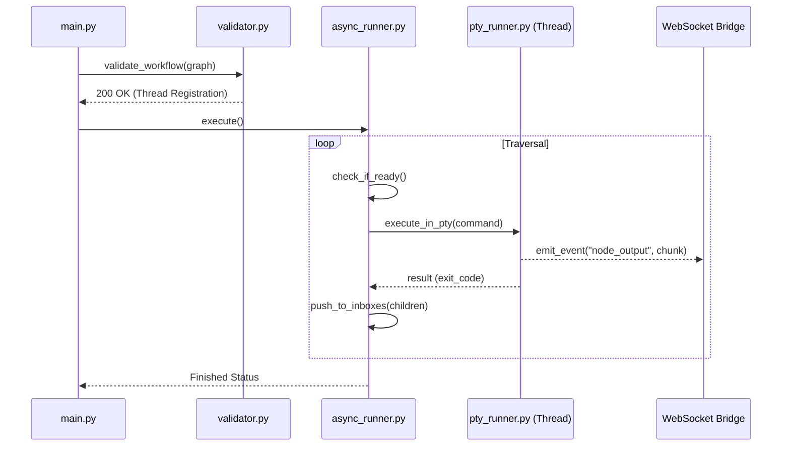

# FlowX2 Execution Engine (Deep Dive)

The Execution Engine is a multi-threaded, asynchronous orchestration layer that transforms static graph definitions into dynamic, event-driven workflows. It manages the lifecycle of PTY sessions, provides a security-hardened plugin registry, and implements a sophisticated "Push" graph traversal algorithm.

## 🛠 File-by-File Technical Deep Dive

### 1. [protocol.py](file:///home/noir/Studies/main2/FlowX2/backend/engine/protocol.py) — The Interface Layer
This file defines the strict contract all nodes must follow. It ensures the engine can treat any plugin as a black box with predictable validation and execution phases.

-   **`FlowXNode` (L15-53)**: The abstract base class.
-   **Wait Strategies (L47-53)**:
    -   `ALL` (Default): Ensures all incoming branches are resolved before triggering.
    -   `ANY`: Optimized for racing branches or discriminator patterns (used by `ORMergeNode`).
-   **`RuntimeContext` (L8-13)**: A `TypedDict` that carries the session's fingerprint, `thread_id`, and a reference to the WebSocket `emit_event` callback.

---

### 2. [async_runner.py](file:///home/noir/Studies/main2/FlowX2/backend/engine/async_runner.py) — The Event Loop
The heart of the system. Unlike traditional linear executors, `AsyncGraphExecutor` uses a **Push Engine** where nodes "fire" and notify their children via an inbox system.

-   **Inbox Architecture (L33-35)**: `node_id -> { parent_id: payload }`. This allows nodes to correlate data from multiple incoming branches.
-   **Routing Behaviors (L42-57)**: The `_get_edge_behavior` method detects if an edge is a `conditional`, `failure`, or `always` (fallback) path based on handle IDs and metadata.
-   **The Event Loop (L108-163)**: Uses `asyncio.wait(active_tasks, return_when=asyncio.FIRST_COMPLETED)` to process nodes as soon as they finish, maximizing concurrency.
-   **Branch Skipping (L202-206)**: Implements `SKIP_BRANCH` propagation. If a node is reached only by "skipped" branches, it skips its own execution and passes the skip signal to its children, preventing deadlocks in complex logic.

---

### 3. [pty_runner.py](file:///home/noir/Studies/main2/FlowX2/backend/engine/pty_runner.py) — Secure Execution
Handles the "dirty work" of running shell commands in a way that remains interactive and secure.

-   **Pure Streaming Engine (L34-88)**: Reads 4KB chunks from the PTY and dispatches them via a `pexpect` thread worker.
-   **Sudo Auto-Responder (L42-63)**: Implements a rolling window buffer (last 256 chars) to detect sudo password challenges.
    -   **Injection (L53)**: If a `sudo_password` is provided in the `RuntimeContext`, it's injected via `child.sendline()`.
    -   **Fail-Fast (L57-63)**: If a prompt appears but the vault is empty, the process is aborted to prevent the workflow from hanging.
-   **Thread-to-Loop Bridge (L80)**: Uses `loop.call_soon_threadsafe` to push terminal output from the `pexpect` thread back to the main FastAPI event loop.

---

### 4. [watcher.py](file:///home/noir/Studies/main2/FlowX2/backend/engine/watcher.py) — Async File Events
Bridges the blocking OS-level threads of `watchdog` with the non-blocking nature of `asyncio`.

-   **Event Normalization (L19-38)**: Intercepts atomic renames (common in editors like VS Code or Vim) and re-maps `moved` and `created` events to `modified` to ensure the `FileChangeDetectorNode` triggers reliably.
-   **Observer Pool (L154-170)**: Manages a pool of OS-level watches, automatically unscheduling them when no node is left listening to a specific directory to prevent memory leaks.
-   **Precision Filtering (L52-56)**: Allows a single directory watch to serve multiple nodes with different `target_filter` paths (e.g., watching `src/` but only triggering on `src/main.py`).

---

### 5. [validator.py](file:///home/noir/Studies/main2/FlowX2/backend/engine/validator.py) — Topology Integrity
The gatekeeper that prevents "broken" graphs from ever reaching the runner.

-   **BFS Reachability (L47-57)**: Performs a breadth-first search from the single `StartNode`.
-   **Selective Validation (L62-84)**: Only unreachable nodes are ignored; all reachable nodes must pass their respective `validate()` methods from `protocol.py`.
-   **Critical Error Hub (L103-105)**: Aggregates all errors and returns them as a 400 Bad Request to the frontend if any node is marked as `CRITICAL`.

---

### 6. [registry.py](file:///home/noir/Studies/main2/FlowX2/backend/engine/registry.py) — The Broker
The glue that enables the dynamic plugin system.

-   **Dynamic Import (L59-60)**: Uses `importlib.import_module` to load logic from `plugins/{name}/backend/node.py` at runtime.
-   **API Integration (L70-74)**: If a plugin includes a `backend/router.py`, it is automatically registered with the main FastAPI application.

## 🔄 Sequence: The Engine Lifecycle

## 🛡 Security & Resilience

-   **Sandboxed Context (L219)**: Nodes never get access to the global `engine` instance; they only interact via a sanitized `RuntimeContext`.
-   **Non-Blocking I/O**: All blocking operations (PTY, Watchdog) are isolated in separate threads, ensuring the FastAPI server remains responsive.
-   **Crash Recovery Support**: Every node completion is saved to MongoDB via a fire-and-forget task (`_update_db_status` in `async_runner.py:L69`), enabling the `/resume` feature.
