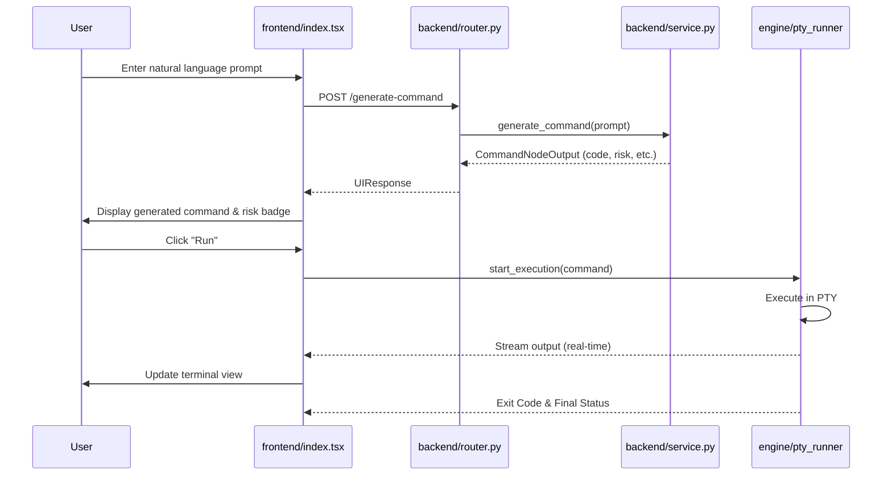

# Bash Command Node (`CommandNode`)

The `CommandNode` is a powerful system-level plugin for FlowX2 that allows users to generate and execute Bash commands directly within a workflow. It leverages AI for intelligent command generation and provides a real-time terminal interface for execution and interaction.

## 🚀 Key Features

-   **AI Command Generation**: Uses Groq-powered LLMs to translate natural language prompts into executable Bash commands.
-   **Hybrid PTY Runner**: Executes commands in a pseudo-terminal (PTY) environment, supporting interactive input and real-time streaming.
-   **Sudo Support & Security Locking**: Includes a "Sudo Lock" mechanism to handle privileged operations securely.
-   **Real-Time Terminal UI**: Integrated Xterm.js terminal with dual-tab view (Read-only Output vs. Interactive Terminal).
-   **Validation System**: Built-in regex checks for placeholders and unreplaced variables.
-   **Execution History**: Tracks generated and executed commands with status and timestamps.

## 🔄 Overall Flow

The following diagram illustrates the lifecycle of a command within the `CommandNode`:



## 🛠 Backend Implementation

### Node Logic (`backend/node.py`)
The [CommandNode](file:///home/noir/Studies/main2/FlowX2/plugins/CommandNode/backend/node.py) class extends `FlowXNode` and handles the core execution logic.

**Validation**:
It ensures the command is not empty and contains no unreplaced placeholders (e.g., `<VARIABLE>`).
```python
# node.py:L23-29
placeholder_pattern = re.compile(r"<[^>]+>")
if command and placeholder_pattern.search(command):
    errors.append({
        "nodeId": node_id,
        "message": "Command contains unreplaced placeholders",
        "level": "CRITICAL"
    })
```

**Execution**:
Executes the command via `execute_in_pty` and streams logs back to the frontend using an `emit_event` callback.
```python
# node.py:L136-140
exit_code, stdout, stderr = await execute_in_pty(
    command=command,
    sudo_password=password_to_inject,
    on_output=stream_logger
)
```

### AI Service (`backend/service.py`)
The [service.py](file:///home/noir/Studies/main2/FlowX2/plugins/CommandNode/backend/service.py) handles the interaction with Groq. It uses a primary model and a fallback model to ensure reliability.

**System Prompt Strategy**:
It instructs the AI to be an "Expert Arch Linux Administrator" and enforces rules like including `sudo` when necessary.
```python
# service.py:L53-56
1. If the action requires root (updates, installs, systemctl), you MUST include 'sudo' at the start of the `code_block`.
2. Do NOT assume the user will add it later.
3. Do NOT use 'sudo' for operations inside the user's home directory (~/) or read-only checks.
```

### Schemas (`backend/schema.py`)
Defines the communication contract between the backend and frontend.
- `CommandNodeOutput`: Strict schema for AI generation, including `risk_level` and `system_effect`.
- `UIResponse`: Maps backend data to frontend-friendly structures.

## 💻 Frontend UI

The UI is built with React and `@xyflow/react`. The entry point is [index.tsx](file:///home/noir/Studies/main2/FlowX2/plugins/CommandNode/frontend/index.tsx).

-   **Dual Terminal View**: Switches between a read-only stream of logs (`OUTPUT`) and a fully interactive Bash session (`TERMINAL`).
-   **Validation Shield**: Displays runtime and static validation errors.
-   **Auto-Lock**: Automatically locks the node if the AI identifies the command as `CAUTION` or `CRITICAL` risk.

## 🔐 Security & Sudo Lock

The `CommandNode` prioritizes safety:
1.  **Node Lock**: A general safety switch that prevents execution unless manually toggled.
2.  **Sudo Lock**: If enabled, the node requires a `sudo_password` passed via the runtime context (usually provided by a upstream `VaultNode`).
3.  **Risk Assessment**: The AI assesses risk levels (`SAFE`, `CAUTION`, `CRITICAL`), which is visually represented in the UI.

## 📝 Configuration

| Property | Description |
| :--- | :--- |
| `command` | The raw Bash command to execute. |
| `prompt` | The natural language intent used for generation. |
| `locked` | Boolean flag to prevent accidental execution. |
| `sudoLock` | Enables password injection for `sudo` commands. |
| `system_context` | JSON object containing system fingerprints or variables. |

## 📖 Usage Guide

1.  **Generate**: Type your intent in the search bar (e.g., "Check system updates").
2.  **Review**: Examine the generated command and the risk level badge.
3.  **Configure**: If `sudo` is required, ensure `Sudo Lock` is enabled and a password provider node is connected.
4.  **Execute**: Unlock the node and click "Run". Monitor the real-time output in the integrated terminal.
