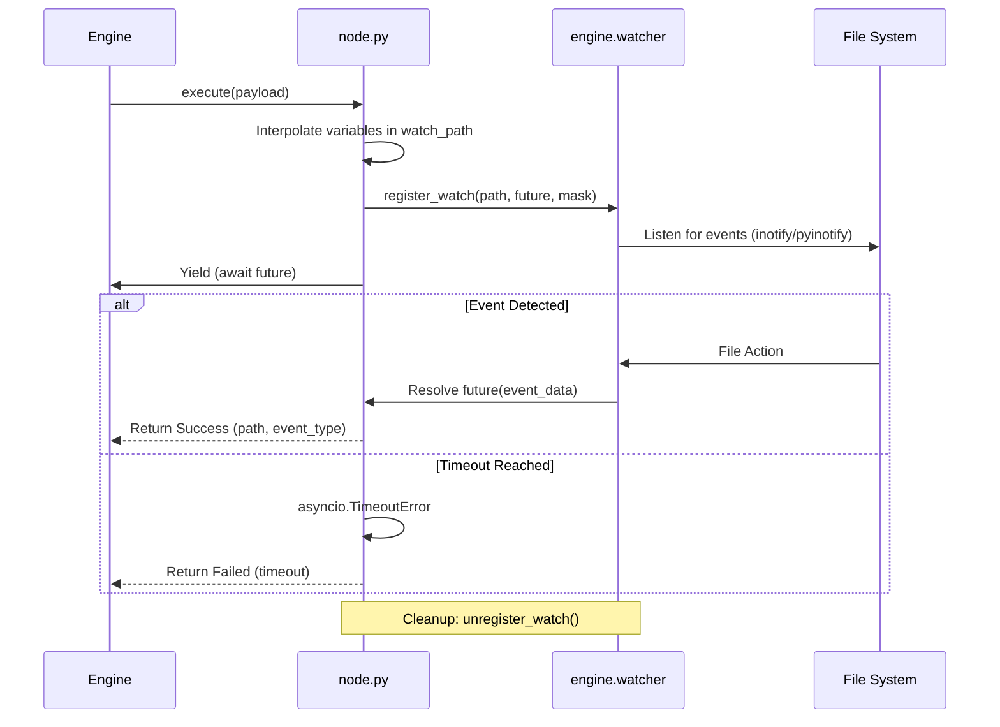

# Wait For File Change (`FileChangeDetectorNode`)

The `FileChangeDetectorNode` is a system-level plugin designed to suspend workflow execution until a specific file system event occurs. It is ideal for workflows that depend on external file triggers, such as waiting for a build artifact to appear or a configuration file to be updated.

## 🚀 Key Features

-   **Dynamic Path Resolution**: Supports variable interpolation (e.g., `{{inputs.node_id.path}}`) to resolve watch paths at runtime.
-   **Granular Event Masks**: Monitor for file/directory **creation**, **modification**, or **deletion**.
-   **Recursive Monitoring**: Option to monitor all subdirectories within a target path.
-   **Workflow Suspension**: Efficiently "parks" the workflow thread using `asyncio.Future`, consuming minimal resources while waiting.
-   **Timeout Support**: Configurable timeout to prevent workflows from hanging indefinitely.

## 🔄 Overall Flow

The node operates by registering a watch and yielding execution back to the FlowX engine until an event or timeout occurs.



## 🛠 Backend Implementation

The core logic resides in [node.py](file:///home/noir/Studies/main2/FlowX2/plugins/FileChangeDetectorNode/backend/node.py).

### Path Interpolation
The node resolves dynamic paths using the `_interpolate_path` method, allowing it to use outputs from previous nodes.
```python
# node.py:L42-45
def _interpolate_path(self, path: str, inputs: Dict[str, Any]) -> str:
    """
    Replaces {{inputs.node_id.field}} with actual data from execution context.
    """
    # ... regex replacement logic ...
```

### Async Suspension
Execution is suspended using `asyncio.wait_for` on a `Future` object provided to the `file_watch_manager`.
```python
# node.py:L131-136
try:
    if effective_timeout is not None:
        event_data = await asyncio.wait_for(future, timeout=effective_timeout)
    else:
        event_data = await future
```

## 💻 Frontend UI

The UI ([index.tsx](file:///home/noir/Studies/main2/FlowX2/plugins/FileChangeDetectorNode/frontend/index.tsx)) provides a clear configuration interface:

-   **Path Input**: A mono-spaced input field for the watch path with variable support hint.
-   **Event Toggles**: Checkboxes for `created`, `modified`, and `deleted`.
-   **Recursive Switch**: A toggle for flat vs. recursive monitoring.
-   **Timeout Field**: Numeric input for seconds (0 = infinite wait).
-   **Status Badges**: Visual indicators for "Watching", "Triggered", or "Timeout".

## 📝 Configuration

| Property | Description | Default |
| :--- | :--- | :--- |
| `watch_path` | Absolute path to the file/directory. Supports `{{vars}}`. | `""` |
| `event_mask` | List of events: `created`, `modified`, `deleted`. | All three |
| `recursive` | Boolean. If true, monitors subdirectories. | `false` |
| `timeout` | Time in seconds to wait before failing. | `0` (Infinite) |

## ⚠️ Important Considerations

1.  **Path Existence**: The directory containing the `watch_path` (or the file itself if monitoring modification) must exist when the node starts.
2.  **Resource Handling**: The node automatically cleans up (unregisters) watches in its `finally` block to prevent "zombie" watchers.
3.  **Variable Resolution**: Ensure that any nodes providing variables to the `watch_path` have completed successfully before this node starts (Wait Strategy is set to `ALL`).
