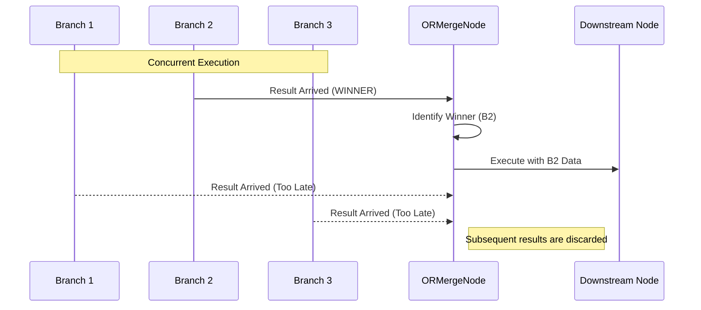

# OR Merge (Discriminator Gate) (`ORMergeNode`)

The `ORMergeNode` is a flow-control plugin that acts as a **discriminator gate**. It is used to converge multiple execution paths (branches) into a single path, firing as soon as the **first** valid result arrives from any of its parent nodes.

## 🚀 Key Features

-   **Race-to-Finish Logic**: The first branch to successfully complete and provide data triggers the node.
-   **Execution Discarding**: Once the first branch "wins", the node execution proceeds; any subsequent results from slower branches are effectively ignored for this specific activation.
-   **Data Pass-Through**: Transparently passes the data from the winning branch to all downstream connected nodes.
-   **Wait Strategy**: Implements the `ANY` wait strategy, allowing for high-concurrency flow patterns.

## 🔄 Overall Flow

The `ORMergeNode` behaves like a race detector at a convergence point.



## 🛠 Backend Implementation

The logic is remarkably simple but powerful, relying on the FlowX engine's coordination.

### Wait Strategy
The most critical part of the [node.py](file:///home/noir/Studies/main2/FlowX2/plugins/ORMergeNode/backend/node.py) implementation is the `get_wait_strategy` method.
```python
# node.py:L44-46
def get_wait_strategy(self) -> str:
    # This tells the engine: "Run me as soon as ONE valid input arrives!"
    return "ANY"
```

### Execution & Winner Selection
In the `execute` method, the node identifies which parent provided the data by inspecting the `inputs` payload provided by the engine.
```python
# node.py:L26-28
if inputs:
    winner_id = next(iter(inputs))
    winner_data = inputs[winner_id]
```

## 💻 Frontend UI

The UI ([index.tsx](file:///home/noir/Studies/main2/FlowX2/plugins/ORMergeNode/frontend/index.tsx)) is designed for clear visual feedback during race conditions:

-   **Compact Design**: A streamlined card with a `GitMerge` icon.
-   **State Visualization**:
    -   **Amber (Running)**: Waiting for any branch to complete.
    -   **Green (Completed)**: A winner has arrived.
    -   **Gray (Skipped)**: The entire node was bypassed by upstream logic.
-   **Handles**: Single input (target) and output (source) handles for integration into the graph.

## 📝 Configuration

The `ORMergeNode` requires no complex configuration by the user; its behavior is determined by the topology of the workflow (the nodes connected to its input).

| Property | Description |
| :--- | :--- |
| `name` | An optional label for the node (defaults to "OR Merge"). |

## 💡 Best Practices

1.  **Race Scenarios**: Use this when you have multiple ways to achieve a result (e.g., querying two different APIs) and you only care about the fastest response.
2.  **Error Handling**: Note that the node fires on the first *valid* completion. If a branch fails, the engine's behavior depends on the overall error propagation settings.
3.  **Variable Usage**: Downstream nodes can access the winner's data. If you need to know *which* node won, the node outputs the winner's ID in the `_merged_from` metadata.
