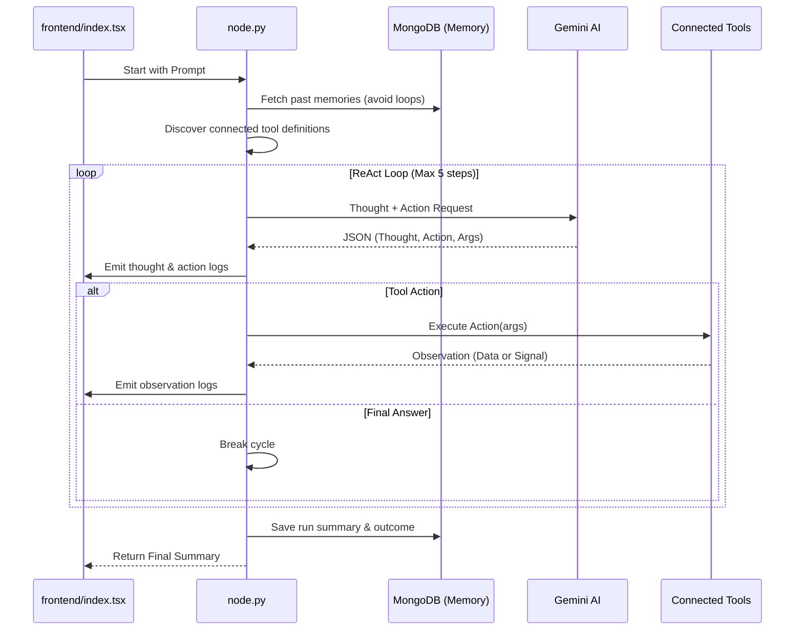

# ReAct Agent V2 (`ReActAgentNodeV2`)

The `ReActAgentV2` is an autonomous intelligence node designed for multi-step reasoning and tool execution. Leveraging the **ReAct (Reason + Act)** pattern, it can observe the environment, think about its goals, and execute actions via connected tool nodes until a final answer is reached.

## 🚀 Key Features

-   **Autonomous Reasoning Loop**: Iteratively processes thoughts, actions, and observations (up to 5 steps by default).
-   **Dynamic Tool Discovery**: Automatically detects and loads capabilities from connected parent "Tool" nodes.
-   **Run-Scoped Memory**: Persists execution history in MongoDB to avoid repeating failures and to handle restart loops gracefully.
-   **Intelligent Context Management**: Uses a sliding window to manage conversation history and prevent token overflow while maintaining the system persona.
-   **Signal Handling**: Can autonomously trigger "Stop" or "Restart" signals to influence the wider workflow state.
-   **Real-Time Observation**: Dual-pane UI allowing users to switch between the instruction prompt and a live log of the agent's internal monologue.

## 🔄 Overall Flow

The agent operates in a closed-loop cycle within a single workflow execution.



## 🛠 Backend Implementation

The backend logic is implemented in [node.py](file:///home/noir/Studies/main2/FlowX2/plugins/ReActAgentV2/backend/node.py).

### Dynamic Capability Loading
The agent identifies tools by inspecting its inputs at runtime.
```python
# node.py:L130-137
if isinstance(output, dict) and output.get("type") == "TOOL_DEF":
    tool_def = output.get("definition")
    t_name = tool_def["name"]
    
    if "implementation" in output:
        allowed_tools[t_name] = output["implementation"]
        tool_definitions.append(tool_def)
```

### Run-Scoped Memory
To prevent infinite loops and improve reliability, the agent consults its memory of previous runs.
```python
# node.py:L40-49
async def fetch_agent_memory(run_id: str, node_id: str, limit: int = 5) -> List[Dict]:
    """Retrieves the last N memory entries for this specific agent run."""
    # ... MongoDB fetch logic ...
```

### Signal Handling
The agent can process special signals like `__FLOWX_SIGNAL__RESTART` returned by tools.
```python
# node.py:L265-272
if isinstance(tool_output, str) and tool_output.startswith("__FLOWX_SIGNAL__"):
    signal_type = 'restarting' if 'RESTART' in tool_output else 'stopped'
    # ... emit status and save memory ...
```

## 💻 Frontend UI

The UI ([index.tsx](file:///home/noir/Studies/main2/FlowX2/plugins/ReActAgentV2/frontend/index.tsx)) emphasizes the agent's "Thinking" state:

-   **Dual Mode**: Toggle between **Mission Directive** (text input) and **Agent Logs** (execution history).
-   **Visual Feedback**: Uses distinctive glows (yellow for thinking, amber for restarting) and a spinning border gradient during active cycles.
-   **Auto-Scrolling Logs**: The log view automatically stays pinned to the latest "Thought" or "Observation".
-   **Resizable Interface**: Can be expanded to a wider view for easier log reading.

## ⚙️ Advanced Configuration (Environment Variables)

The agent's behavior can be tuned via the following environment variables:

| Variable | Description | Default |
| :--- | :--- | :--- |
| `GOOGLE_MODEL` | The Gemini model to use for reasoning. | `gemini-2.0-flash` |
| `REACT_AGENT_MAX_STEPS` | Max number of ReAct cycles per execution. | `5` |
| `REACT_AGENT_COOLDOWN` | Wait time (seconds) between LLM calls to prevent rate-limiting. | `2` |
| `REACT_AGENT_CTX_WINDOW` | Max number of conversation pairs to keep in sliding window. | `6` |

## 💡 Best Practices

1.  **Tool Granularity**: Connect specific tool nodes (e.g., `ShellTool`, `WriteFileTool`) to give the agent exactly the authorities it needs.
2.  **Clear Instructions**: Use the **Mission Directive** to provide clear goals and constraints. The agent is more effective when told *what* the success criteria are.
3.  **Memory Awareness**: The agent is aware of its past failures. If it keeps failing, check the logs to see if it's missing a necessary tool or if the instructions are ambiguous.
