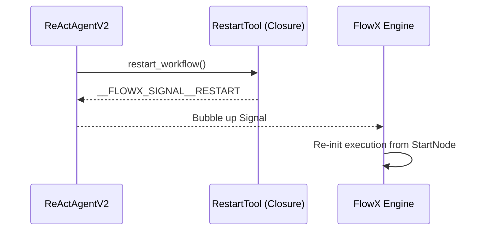

# Restart Tool (`RestartToolNode`)

The `RestartTool` is a flow-control signal node that allows agents to reset the workflow and start from the beginning. This is particularly useful for recovering from temporary failures or retrying a mission after the agent has modified the environment (e.g., fixed a configuration file).

## 🚀 Key Features

-   **Autonomous Recovery**: Allows the agent to trigger a full system reset.
-   **Loop Preservation**: When combined with `ReActAgentV2` memory, the agent remembers *why* it restarted, preventing it from making the same mistake twice.
-   **Full Cycle**: Resets the engine's execution pointer back to the `StartNode`.

## 🔄 Interaction Flow

The agent triggers a restart by returning a specific signal string.



## 🛠 Backend Implementation

The backend ([node.py](file:///home/noir/Studies/main2/FlowX2/plugins/RestartTool/backend/node.py)) provides the restart signal:

```python
# node.py:L4-7
def restart_workflow_func(args: str = "") -> str:
    """Restarts the workflow from the beginning."""
    print(f"[RESTART TOOL 🟠] Emitting Signal: RESTART")
    return "__FLOWX_SIGNAL__RESTART"
```

## 💻 Frontend UI

The UI ([index.tsx](file:///home/noir/Studies/main2/FlowX2/plugins/RestartTool/frontend/index.tsx)) uses amber/orange themes to represent a transition state:

-   **Rotate Icon**: Uses the `RotateCcw` icon for clarity.
-   **Amber Glow**: Pulsates when a restart is initiated.
-   **Spinning Gradient**: An amber/amber-yellow gradient spin indicating the reset is in progress.

## ⚙️ Schema

The agent uses the following simple schema:

| Parameter | Type | Description |
| :--- | :--- | :--- |
| `args` | `string` | Optional arguments (currently ignored by the restart function). |

## 💡 Best Practices

1.  **State Fixes**: Only restart if you have made a change that requires a fresh start (e.g., installed a new dependency or edited a source file).
2.  **Memory Check**: ReActAgentV2 will see the "triggered_restarting" outcome in its memory on the next run. Guide the agent to use this information to choose a different path.
