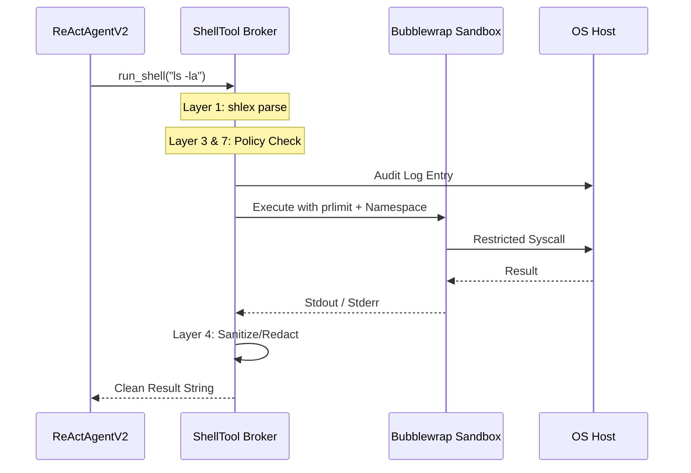

# Shell Tool (`ShellToolNode`)

The `ShellTool` is a robust, security-hardened execution broker that provides FlowX agents with sandboxed access to the host operating system. It implements 8 layers of defensive security to prevent escape, resource exhaustion, and destructive commands.

## 🚀 Key Features

-   **8 Layers of Security**: Includes Bubblewrap (`bwrap`) isolation, `prlimit` quotas, argument heuristics, and output sanitization.
-   **Capability Profiles**: Granular control over what the agent can do via pre-configured profiles:
    -   **Read Only**: Safe exploration (ls, cat, find).
    -   **Developer**: Full build lifecycle (pip, npm, git, gcc).
    -   **Ops**: System monitoring (systemctl, journalctl, df).
-   **Zero-Shell Execution**: Arguments are parsed by `shlex` and executed directly without a shell interpreter, blocking `;`, `&&`, and `|` injection.
-   **Resource Quotas**: Hard limits on RAM, CPU time, and concurrent processes.
-   **Prompt Injection Defense**: Detects and redacts "IGNORE PREVIOUS INSTRUCTIONS" and similar patterns in tool output.

## 🛡 Security Architecture

The execution broker in [node.py](file:///home/noir/Studies/main2/FlowX2/plugins/ShellTool/backend/node.py) applies defense-in-depth:

### Layered Defense Stack
1.  **shlex argv parse**: No `shell=True`.
2.  **bwrap namespace**: Filesystem isolation (tmpfs, ro-binds).
3.  **Capability profiles**: Binary allowlisting.
4.  **Output sanitization**: Redacting secrets and ANSI codes.
5.  **Audit Log**: Every command is logged to MongoDB before execution.
6.  **prlimit**: RAM, CPU, and proc quotas.
7.  **Flag heuristics**: Blocking dangerous flags like `python -c` or `find -exec`.
8.  **Non-interactive env**: `stdin=DEVNULL` and stripped environment variables.

### Capability Profiles Configuration
```python
# node.py:L58-85 (Summary)
"developer": {
    "allowed": ["ls", "cat", "git", "pip", "node", "gcc", ...],
    "network": True,
    "write": True,
    "ram_bytes": 512 * 1024 * 1024,
    "cpu_seconds": 30
}
```

## 🔄 Interaction Flow



## 💻 Frontend UI

The UI ([index.tsx](file:///home/noir/Studies/main2/FlowX2/plugins/ShellTool/frontend/index.tsx)) allows designers to set constraints:

-   **Profile Selector**: Dropdown to switch between Read-Only, Developer, and Ops modes.
-   **Visual Indicators**: Color-coded badges and icons based on the active security profile.
-   **Status feedback**: Real-time glow and spin effects while the sandbox is active.

## ⚙️ Profile Details

| Profile | Network | Write | Max RAM | CPU Limit | Use Case |
| :--- | :--- | :--- | :--- | :--- | :--- |
| **Read Only** | ❌ No | ❌ No | 256 MB | 10s | Research and discovery. |
| **Developer** | ✅ Yes | ✅ Yes | 512 MB | 30s | Building and deploying code. |
| **Ops** | ❌ No | ❌ No | 128 MB | 10s | Monitoring system logs/services. |

## 💡 Best Practices

1.  **Principle of Least Privilege**: Always start with the `Read Only` profile. Only upgrade to `Developer` if the agent specifically needs to write files or access the network.
2.  **Statelessness**: Remember that each tool call starts in a fresh sandbox. `cd` commands will not persist across steps.
3.  **Output Volume**: The tool truncates output at a profile-specific limit (e.g., 16KB). If you have a huge file, use `grep` or `tail` to extract only what is needed.
