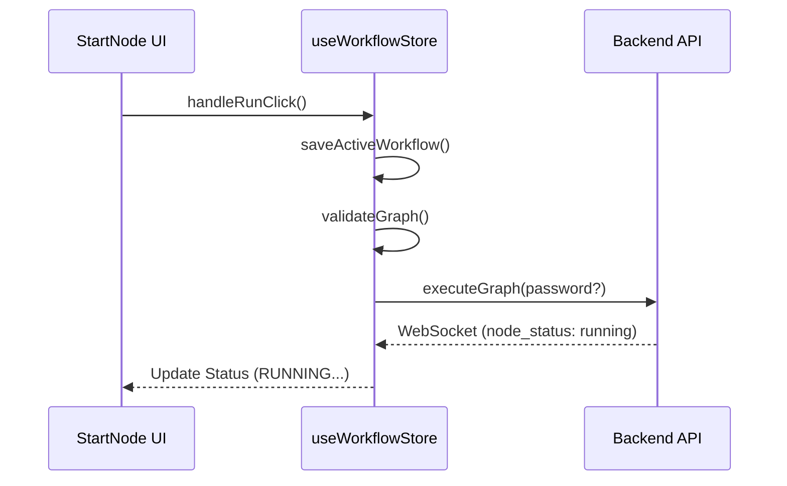

# Start Node (`StartNode`)

The `StartNode` is the entry point for every FlowX2 workflow. It serves as the orchestrator for the initiation phase, handling graph validation, state preservation, and execution triggering.

## 🚀 Key Features

-   **Execution Trigger**: Provides the primary "Play" button to start the workflow.
-   **Graph Validation**: Automatically triggers a full graph validation sequence before execution begins.
-   **Sudo Orchestration**: Detects when elevated privileges are required and manages the password challenge modal (integrating with `VaultNode` or manual input).
-   **Cancellation Control**: Transforms into a "Stop" button (Square) while the workflow is running, allowing for immediate abort requests.

## 🔄 Initiation Flow

The `StartNode` follows a strict sequence to ensure the workflow is valid before it hits the engine.



## 🛠 Implementation Details

### Backend (`node.py`)
The backend logic is a pass-through that signals the formal start of the execution chain.
```python
# node.py:L12-15
async def execute(self, context: RuntimeContext, payload: Dict[str, Any]) -> Dict[str, Any]:
    # It initiates the workflow flow.
    return {"status": "success", "output": "Workflow Started"}
```

### Frontend Initiation Sequence
The frontend handles the complex coordination of saving and validation.
```typescript
// index.tsx:L97-101
const runExecution = useCallback(async (password?: string) => {
    try {
        await saveActiveWorkflow();
        await validateGraph();
        await executeGraph(password); // Engine state takes over via WS
    } catch (error: any) {
        // ... handle sudo or validation errors ...
    }
}, [...]);
```

## 💻 UI Visualization

-   **Dynamic Icon**: Switches between `Play` (Idle) and `Square` (Running/Aborting).
-   **Status Text**: Displays `RUNNING...`, `COMPLETED ✓`, or `FAILED ✗` based on the global execution state.
-   **Validation Shield**: A reactive badge that appears in the top-right corner if the node or the graph has validation issues.

## 📝 Configuration

The `StartNode` is largely automatic. You can optionally set a **Name** for the initiator in its configuration panel.

| Property | Description |
| :--- | :--- |
| `name` | Human-readable label for the start point (defaults to "Start"). |

## 💡 Best Practices

1.  **Single Start Point**: While the engine supports multiple entry points theoretically, most stable workflows use exactly one `StartNode`.
2.  **Sudo Integration**: If your workflow contains `CommandNode`s with `sudo` enabled, ensure you have a `VaultNode` connected or stay prepared for the sudo modal challenge from the `StartNode`.
