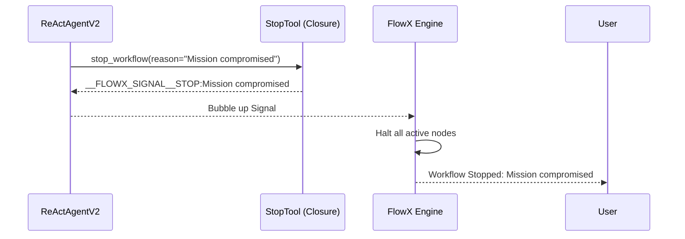

# Stop Tool (`StopToolNode`)

The `StopTool` is a flow-control signal node that allows agents to permanently terminate a workflow execution when they encounter unrecoverable errors or determine that the current mission is impossible.

## 🚀 Key Features

-   **Autonomous Termination**: Enables agents to signal the engine to halt all execution immediately.
-   **Reason Propagation**: Accepts a `reason` argument that is propagated through the engine logs and displayed to the user.
-   **Visual Signal**: Real-time status updates on the frontend to indicate the workflow has been intentionally stopped.

## 🔄 Interaction Flow

The agent triggers a stop by returning a special signal string that the engine's runtime context recognizes.



## 🛠 Backend Implementation

The backend ([node.py](file:///home/noir/Studies/main2/FlowX2/plugins/StopTool/backend/node.py)) defines the signal structure:

```python
# node.py:L4-7
def stop_workflow_func(reason: str = "Stopped by Agent") -> str:
    """Stops the workflow immediately."""
    print(f"[STOP TOOL 🔴] Emitting Signal: STOP ({reason})")
    return f"__FLOWX_SIGNAL__STOP:{reason}"
```

## 💻 Frontend UI

The UI ([index.tsx](file:///home/noir/Studies/main2/FlowX2/plugins/StopTool/frontend/index.tsx)) uses high-visibility red themes to indicate control:

-   **Octagon Icon**: Uses the `OctagonX` icon to represent a hard stop.
-   **Power Surge Glow**: Pulsates red when the stop signal is being processed.
-   **Spinning Border**: A rapid red/rose gradient spin during the termination sequence.

## ⚙️ Schema

The agent uses the following schema to call the tool:

| Parameter | Type | Description |
| :--- | :--- | :--- |
| `reason` | `string` | The explanation for stopping the workflow. |

## 💡 Best Practices

1.  **Safety First**: The agent should call `stop_workflow` if it detects it is in an infinite loop or if its actions might cause damage it cannot repair.
2.  **User Feedback**: Always provide a descriptive reason so the user understands why the agent decided to quit.
