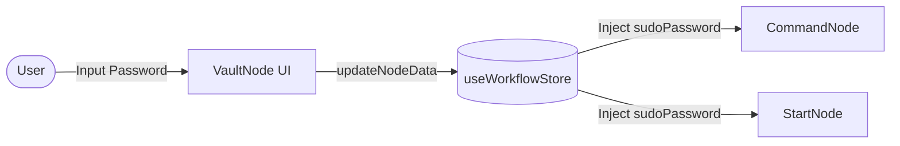

# Credentials Vault (`VaultNode`)

The `VaultNode` is a secure configuration component designed to store sensitive credentials, such as `sudo` passwords, required for privileged operations within a workflow.

## 🚀 Key Features

-   **Secure Frontend Storage**: Captures and holds sensitive strings locally in the workflow state using a masked password field.
-   **No-Op Backend**: To maximize security, the backend implementation is a "no-op" that executes instantly without persisting or processing the data on the server side.
-   **Interactive UI**: Provides a dedicated input card with visual feedback when a password is set.

## 🔄 Interaction Flow

The `VaultNode` interacts exclusively with the frontend state manager to provide credentials to other nodes.



## 🛠 Implementation Details

### Backend (`node.py`)
The backend is designed to be as thin as possible to avoid unnecessary handling of sensitive data.
```python
# node.py:L9-13
async def execute(self, ctx: Dict[str, Any], payload: Dict[str, Any]) -> Dict[str, Any]:
    return {
        "status": "success",
        "message": "Vault configuration loaded."
    }
```

### Frontend (`index.tsx`)
The frontend manages the password input and syncs it with the `sudoPassword` key in the node's data.
```typescript
// index.tsx:L7-9
const handlePasswordChange = (e: React.ChangeEvent<HTMLInputElement>) => {
    updateNodeData(id, { sudoPassword: e.target.value });
};
```

## 💻 UI Visualization

-   **Lock Icon**: Identifying the node's security purpose.
-   **Masked Input**: Standard password field behavior (`••••••••`).
-   **Active Indicator**: A pulse animation appears when a password is saved, confirming the vault is "Active".

## 📝 Usage

1.  Add a **Credentials Vault** node to your graph.
2.  Enter your `sudo` password into the field.
3.  Nodes that require elevated privileges (like `CommandNode` or workflows started with `sudo`) will automatically look for this data if provided.

> [!NOTE]
> The vault password is kept in the local browser state while the session is active. It is not permanently stored as plain text in the workflow database.
