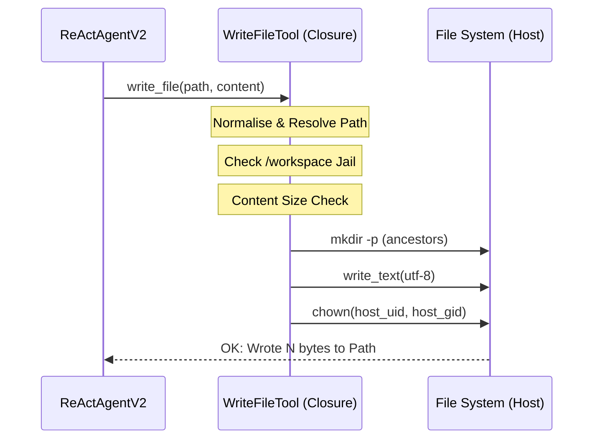

# Write File Tool (`WriteFileToolNode`)

The `WriteFileTool` is a high-security capability node that provides ReAct agents with the ability to create and modify UTF-8 text files on the host system. It is designed to complement the `ShellTool` by providing a safe, dedicated mechanism for I/O that avoids the risks of shell redirections.

## 🚀 Key Features

-   **Dedicated I/O**: Uses native Python `open()` calls instead of shell commands, eliminating shell-injection risks for file creation.
-   **Path Traversal Guards**: Strictly enforces a jail policy, ensuring all writes occur within the designated `/workspace` directory.
-   **Auto-Directory Creation**: Automatically creates missing parent directories (`mkdir -p` semantics).
-   **Size Constraints**: Caps individual file writes at **1 MB** to prevent disk exhaustion.
-   **Ownership Mapping**: Automatically syncs file ownership (UID/GID) between the host and the sandbox environment.

## 🔄 Interaction Flow

The agent interacts with this node via a sandboxed closure injected during initiation.



## 🛡 Security Architecture

The tool implementes a rigorous security model in [node.py](file:///home/noir/Studies/main2/FlowX2/plugins/WriteFileTool/backend/node.py):

### Path Jail Resolution
The tool resolves symlinks and absolute paths to ensure they never escape the `WRITE_BASE_DIR`.
```python
# node.py:L74-78
if not target.is_relative_to(resolved_base):
    return (
        f"Error: Path '{path}' resolves outside the allowed write root "
        f"({resolved_base}). Writes are restricted to /workspace."
    )
```

### Capability Injection
The tool is packaged as a `TOOL_DEF` which the agent cannot inspect or modify.
```python
# node.py:L180-184
return {
    "status": "success",
    "output": {
        "type":           "TOOL_DEF",
        "definition":     WRITE_FILE_TOOL_DEF,
        "implementation": _write_file,
    },
}
```

## 💻 Frontend UI

The UI ([index.tsx](file:///home/noir/Studies/main2/FlowX2/plugins/WriteFileTool/frontend/index.tsx)) is intentionally minimal, as the node serves as a capability provider:

-   **Connection Guard**: Only allows connections to `reactAgent` and `reactAgentV2` nodes.
-   **Power Surge Glow**: Pulsates when the agent is actively writing to the disk.
-   **Base Dir Label**: Displays `/workspace` to remind the user of the isolation boundary.

## 📝 Configuration (JSON Schema)

The agent receives the following schema to understand how to call the tool:

| Parameter | Type | Description |
| :--- | :--- | :--- |
| `path` | `string` | Destination file path (e.g., `src/main.py`). |
| `content` | `string` | Full UTF-8 text content to write. |

## 💡 Best Practices

1.  **Chaining**: Use this tool to write a script, and then use the `ShellTool` in the next step to execute it.
2.  **Incremental Writing**: For very large files, split the content across multiple calls to avoid hitting the 1 MB memory cap.
3.  **UTF-8 Only**: If you need to handle binary data, consider encoding it as base64 within a text file and decoding it via a shell script later.
